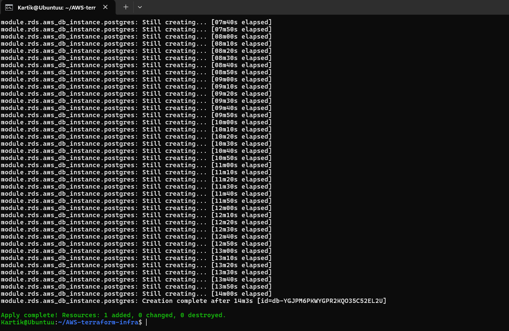
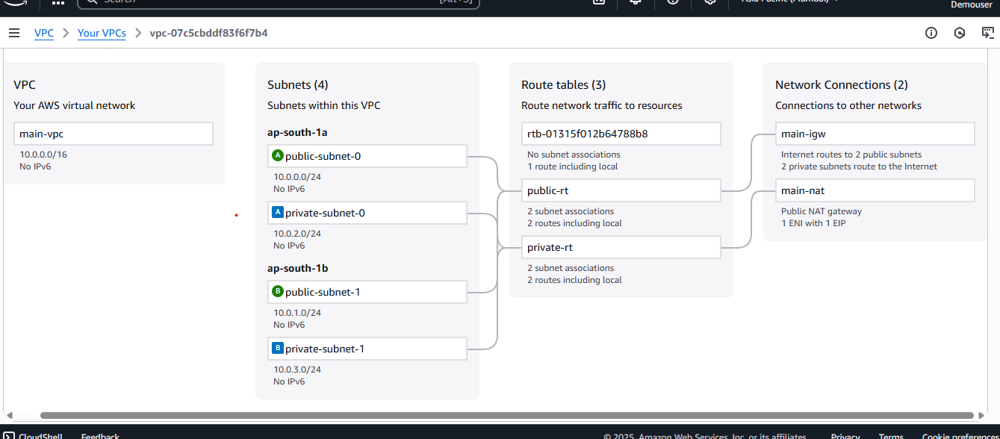

# AWS Infrastructure Automation with Terraform 🚀

## Project Overview
This project automates the deployment of a **secure, scalable, and highly available AWS infrastructure** for hosting containerized applications using Terraform.

We built the following resources:

1. **VPC & Networking** 🌐
   - Created a VPC with **public and private subnets** across multiple Availability Zones (`ap-south-1a` & `ap-south-1b`).
   - Deployed an **Internet Gateway** for public subnet internet access.
   - Deployed a **NAT Gateway** in public subnets to allow private instances to access the internet securely.

2. **ECS (Elastic Container Service)** 🖥️
   - Provisioned ECS clusters using **EC2 launch type** in private subnets.
   - Configured **Auto Scaling Groups (ASG)** to dynamically scale ECS tasks.
   - Created **IAM roles** and **security groups** for ECS instances.

3. **Application Load Balancer (ALB)** ⚖️
   - Deployed an **ALB** in public subnets to route traffic to ECS tasks.
   - Configured **target groups and listeners**.
   - Implemented security groups to allow only necessary traffic.

4. **RDS PostgreSQL Database** 🗄️
   - Deployed **PostgreSQL RDS** in private subnets.
   - Configured database security groups to allow access **only from ECS containers**.
   - Enabled **multi-AZ deployment, automated backups, and monitoring**.

5. **Scalability & Security** 🔒
   - Used **Terraform modules** for VPC, ECS, ALB, and RDS to ensure **reusability**.
   - Applied **least privilege IAM policies** for ECS, ALB, and RDS.
   - Enabled **logging and monitoring** with CloudWatch and VPC Flow Logs.

---

## Directory Structure 📂

AWS-terraform-infra/
├─ alb/ # ALB module
├─ ecs/ # ECS module
├─ rds/ # RDS module
├─ vpc/ # VPC module
├─ main.tf # Root entry point
├─ providers.tf # AWS provider configuration
├─ variables.tf # Global variables
├─ Screenshot/ # Screenshots of infrastructure

## Infrastructure Screenshots 🖼️

### Screenshot 1


### Screenshot 2


---


## How to Use ⚡

1. Clone this repository:

```bash
git clone <repo-url>
cd AWS-terraform-infra
Initialize Terraform:

bash
Copy code
terraform init
Apply the infrastructure:

bash
Copy code
terraform apply -var="db_password=YourSecurePassword"
Terraform will create the VPC, ECS cluster, ALB, and RDS database automatically.

Confirm with yes when prompted.

Destroy infrastructure (optional):

bash
Copy code
terraform destroy -var="db_password=YourSecurePassword"
Notes 📝
AWS region used: ap-south-1 (Mumbai)

RDS database password must follow AWS rules (no @, /, ", or spaces).

Reserved usernames like admin cannot be used for PostgreSQL.

Author 🕉
Kartik Singh


